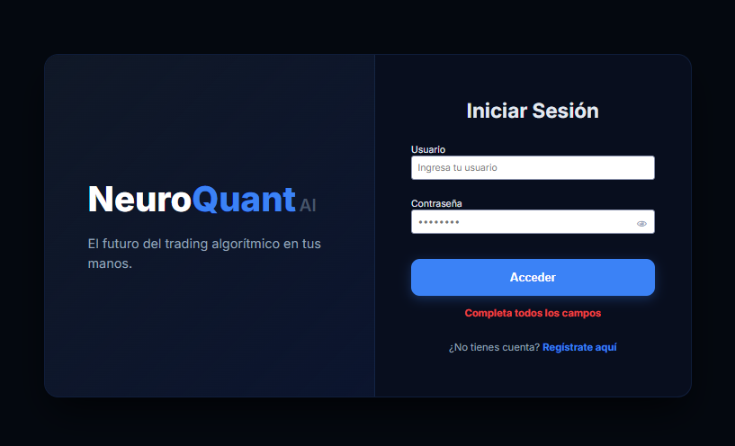
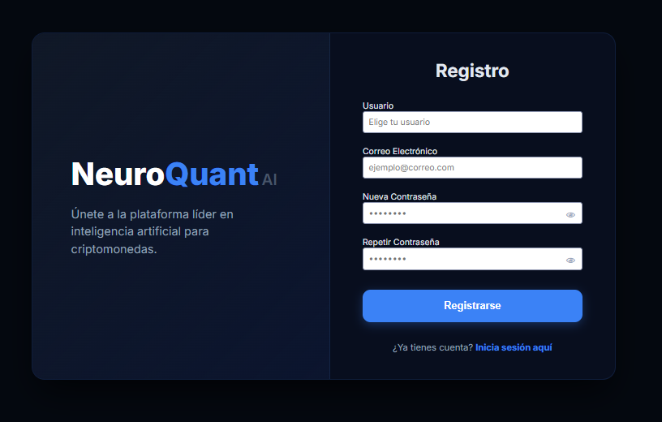
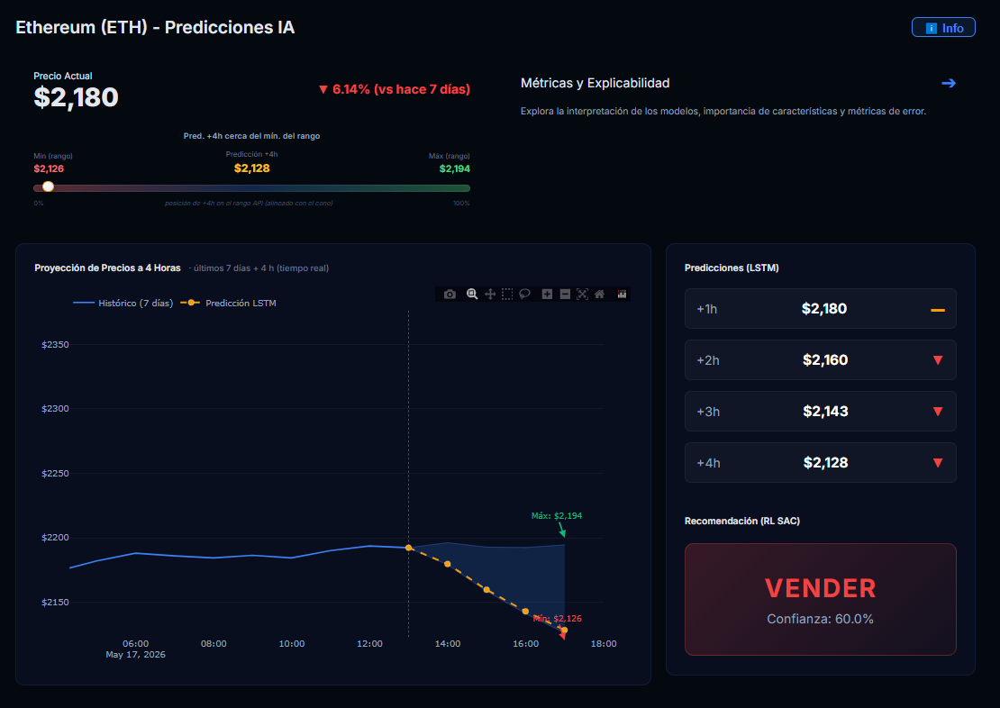
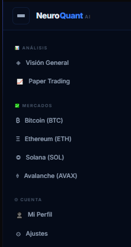
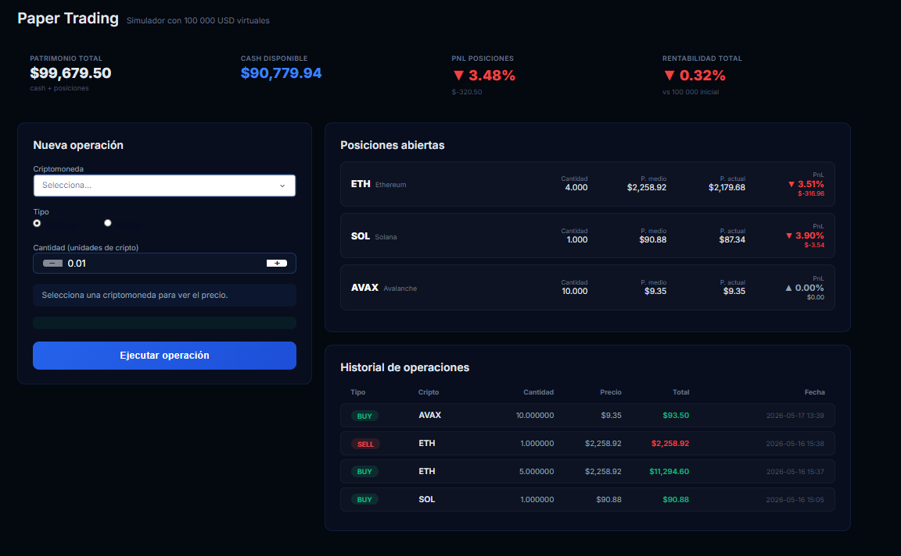

# NeuroQuant — README

> Proyecto de Fin de Máster · Sistema de predicción y decisión sobre criptomonedas mediante Deep Learning y Reinforcement Learning

---

# Tabla de contenidos

* [Descripción general](#descripción-general)
* [Capturas de pantalla](#capturas-de-pantalla)
* [Arquitectura tecnológica](#arquitectura-tecnológica)
* [Métricas del modelo](#métricas-del-modelo)
* [Requisitos previos](#requisitos-previos)
* [Instalación](#instalación)
* [Puesta en marcha](#puesta-en-marcha)
* [Manual de usuario](#manual-de-usuario)
* [Licencia](#licencia)

---

# Descripción general

NeuroQuant es una aplicación de análisis e inteligencia artificial orientada al mercado de criptomonedas. Su objetivo es facilitar la comprensión y la toma de decisiones de inversión mediante dos modelos complementarios:

* Un modelo de predicción de precios basado en **LSTM** que anticipa la evolución del precio en horizontes de 1 a 4 horas.
* Un agente de **Reinforcement Learning** (**SAC — Soft Actor-Critic**) que, a partir de esas predicciones y del contexto de mercado, emite una decisión de acción:

  * `COMPRAR`
  * `VENDER`
  * `MANTENER`

Las criptomonedas cubiertas son:

* BTC
* ETH
* SOL
* AVAX

Los datos se obtienen de la API de Binance e incorporan variables **OHLCV** junto con el índice de **Fear & Greed**.

La explicabilidad de las predicciones se implementa mediante **SHAP KernelExplainer**, y la validación temporal se realiza con la metodología **walk-forward**.

La interfaz de usuario es una aplicación web local construida con **Dash Plotly**, que se comunica con un backend alojado en **Google Colab** y expuesto públicamente mediante **ngrok**.

---

# Capturas de pantalla

## Autenticación

### Inicio de sesión


### Registro


---

## Panel principal

### Dashboard


---

## Panel lateral




---

## Paper Trade

### Simulación de operaciones


---

# Arquitectura tecnológica

| Capa                     | Tecnología                                  |
| ------------------------ | ------------------------------------------- |
| Modelado predictivo      | LSTM (PyTorch)                              |
| Agente de decisión       | SAC — Reinforcement Learning (PyTorch)      |
| Explicabilidad           | SHAP KernelExplainer                        |
| Validación               | Walk-forward                                |
| Datos                    | API Binance · Kaggle · OHLCV + Fear & Greed |
| Backend / API            | FastAPI + ngrok (Google Colab)              |
| Frontend                 | Dash Plotly (Python)                        |
| Autenticación            | SQLite (`.db`)                              |
| Entorno de entrenamiento | Google Colab                                |
| Gestión de dependencias  | `requirements.txt`                          |

---

# Métricas del modelo

## LSTM — Predicción de precios (Test)

### BTC

| Horizonte | MAE (USD) | RMSE (USD) | MAPE (%) | DirAcc |
| --------- | --------: | ---------: | -------: | -----: |
| 1 h       |    257.92 |     371.99 |   0.28 % |  0.590 |
| 2 h       |    358.98 |     508.38 |   0.39 % |  0.612 |
| 3 h       |    436.88 |     616.46 |   0.47 % |  0.620 |
| 4 h       |    499.95 |     699.97 |   0.54 % |  0.640 |

### ETH

| Horizonte | MAE (USD) | RMSE (USD) | MAPE (%) | DirAcc |
| --------- | --------: | ---------: | -------: | -----: |
| 1 h       |     13.16 |      19.73 |   0.43 % |  0.596 |
| 2 h       |     18.22 |      26.61 |   0.59 % |  0.630 |
| 3 h       |     21.92 |      31.85 |   0.71 % |  0.640 |
| 4 h       |     24.92 |      36.21 |   0.81 % |  0.655 |

### SOL

| Horizonte | MAE (USD) | RMSE (USD) | MAPE (%) | DirAcc |
| --------- | --------: | ---------: | -------: | -----: |
| 1 h       |      0.77 |       1.14 |   0.52 % |  0.554 |
| 2 h       |      1.07 |       1.58 |   0.73 % |  0.589 |
| 3 h       |      1.27 |       1.86 |   0.87 % |  0.609 |
| 4 h       |      1.43 |       2.09 |   0.99 % |  0.632 |

### AVAX

| Horizonte | MAE (USD) | RMSE (USD) | MAPE (%) | DirAcc |
| --------- | --------: | ---------: | -------: | -----: |
| 1 h       |      0.09 |       0.15 |   0.55 % |  0.507 |
| 2 h       |      0.12 |       0.21 |   0.78 % |  0.537 |
| 3 h       |      0.15 |       0.26 |   0.94 % |  0.560 |
| 4 h       |      0.17 |       0.30 |   1.08 % |  0.569 |

---

## LSTM — Validación Walk-Forward y Backtesting

| Activo  |   WF DirAcc H1 |   WF DirAcc H4 | Test DirAcc H4 | Win Rate | Profit Factor | Trades |
| ------- | -------------: | -------------: | -------------: | -------: | ------------: | -----: |
| BTC     | 56.9 % ± 1.3 % | 62.0 % ± 1.5 % |         64.0 % |   72.2 % |          6.76 |    550 |
| ETH     | 57.4 % ± 2.7 % | 62.9 % ± 2.6 % |         65.5 % |   74.6 % |          7.33 |    811 |
| SOL     | 54.2 % ± 1.7 % | 60.0 % ± 3.3 % |         63.2 % |   66.0 % |          3.63 |    870 |
| AVAX ⚠  | 51.8 % ± 5.0 % | 59.1 % ± 6.8 % |         56.9 % |   65.3 % |          3.61 |    524 |

> ⚠ AVAX presenta mayor varianza en H1, lo que refleja la mayor volatilidad relativa de este activo.

---

## SAC — Agente RL (vs. Buy & Hold)

### BTC

| Métrica       | SAC Agent | Buy & Hold |
| ------------- | --------: | ---------: |
| Retorno total |  +16.48 % |   −24.08 % |
| Sharpe ratio  |    0.4936 |    −0.2029 |
| Sortino ratio |    0.5743 |    −0.2616 |
| Calmar ratio  |    2.0187 |    −0.4808 |
| Max Drawdown  |    8.17 % |    50.08 % |
| Profit factor |    1.0464 |     0.9843 |

### ETH

| Métrica       | SAC Agent | Buy & Hold |
| ------------- | --------: | ---------: |
| Retorno total | +407.22 % |   −11.74 % |
| Sharpe ratio  |    3.4073 |     0.0479 |
| Sortino ratio |    3.1871 |     0.0626 |
| Calmar ratio  |    89.151 |    −0.1857 |
| Max Drawdown  |    4.57 % |    63.21 % |
| Profit factor |    2.0653 |     1.0038 |

### SOL

| Métrica       | SAC Agent | Buy & Hold |
| ------------- | --------: | ---------: |
| Retorno total |  +36.12 % |   −36.16 % |
| Sharpe ratio  |    1.0556 |    −0.1601 |
| Sortino ratio |    0.6545 |    −0.2136 |
| Calmar ratio  |     4.664 |    −0.5169 |
| Max Drawdown  |    7.74 % |    69.96 % |
| Profit factor |    1.2076 |     0.9881 |

### AVAX

| Métrica       | SAC Agent | Buy & Hold |
| ------------- | --------: | ---------: |
| Retorno total |  +43.32 % |   −61.33 % |
| Sharpe ratio  |    0.5929 |    −0.5961 |
| Sortino ratio |    0.7507 |    −0.7770 |
| Calmar ratio  |    2.0018 |    −0.7982 |
| Max Drawdown  |   21.64 % |    76.83 % |
| Profit factor |    1.0543 |     0.9543 |

El agente SAC supera sistemáticamente a la estrategia pasiva **Buy & Hold** en todos los activos durante el período de evaluación, con una reducción drástica del drawdown máximo en todos los casos.

---

# Requisitos previos

* Python 3.9+
* Cuenta de Google con acceso a Google Colab y Google Drive
* Token de API de ngrok (cuenta gratuita en `ngrok.com`)
* Conexión a Internet activa durante la ejecución

---

# Instalación

## 1. Clona el repositorio

```bash
git clone https://github.com/<tu-usuario>/TFM-NeuroQuant.git
cd TFM-NeuroQuant
```

## 2. Crea y activa un entorno virtual

```bash
python -m venv venv

# Windows
venv\Scripts\activate

# macOS / Linux
source venv/bin/activate
```

## 3. Instala las dependencias

```bash
pip install -r requirements.txt
```

---

# Puesta en marcha

La ejecución del proyecto requiere dos procesos en paralelo:

1. Backend en Google Colab
2. Frontend local con Dash Plotly

Ambos deben estar activos simultáneamente.

---

## Paso 1 — Preparar Google Drive

Copia la carpeta del proyecto en tu Google Drive.

Estructura esperada:

```text
TFM-NeuroQuant/
└── drive/
    ├── NeuroQuant.ipynb
    └── ...
```

---

## Paso 2 — Ejecutar el backend en Google Colab

1. Abre Google Colab y carga el cuaderno:

```text
drive/NeuroQuant.ipynb
```

2. Inicia sesión con tu cuenta de Google y monta el Drive cuando Colab lo solicite.

3. Localiza la celda de configuración de ngrok e introduce tu token:

```python
NGROK_AUTH_TOKEN = "tu_token_aqui"
```

4. Ejecuta todas las celdas en orden.

Al finalizar, Colab expondrá la API mediante ngrok y mostrará una URL pública similar a:

```text
https://xxxx-xx-xx.ngrok-free.app
```

La aplicación local utilizará automáticamente esa URL.

> **Nota de seguridad:** el acceso al backend requiere tanto la clave de ngrok como el archivo de configuración incluido en el repositorio. Sin ambos elementos, ninguna instancia externa puede conectarse ni ejecutar el proyecto.

---

## Paso 3 — Ejecutar el frontend local

Con Colab en ejecución, lanza la aplicación Dash:

```bash
python dashboard/app.py
```

Abre tu navegador y accede a:

```text
http://localhost:8050
```

Serás redirigido automáticamente a la pantalla de inicio de sesión.

---

# Manual de usuario

## Inicio de sesión y registro

Al acceder a `http://localhost:8050` se muestra la pantalla de autenticación.

* Si ya dispones de una cuenta, introduce tus credenciales y pulsa **Iniciar sesión**.
* Si es la primera vez, utiliza el botón de **Registro** para crear una cuenta nueva.

### Credenciales de demostración

| Campo      | Valor  |
| ---------- | ------ |
| Usuario    | `user` |
| Contraseña | `user` |

---

## Dashboard principal

Tras autenticarse, se accede al panel principal, que presenta el estado del portafolio del usuario:

* **Cards de resumen** — muestran la variación de precio de cada criptomoneda respecto al día anterior.
* **Últimas operaciones** — historial de operaciones registradas.
* **Rentabilidad acumulada** — evolución del rendimiento generado hasta el momento.

---

## Panel de navegación lateral

El panel lateral permite navegar entre las secciones principales:

* **Visión General** — dashboard con resumen del portafolio.
* **Paper Trading** — simulación de operaciones sin riesgo real.
* **Mercados** — acceso directo al análisis individual de BTC, ETH, SOL y AVAX.
* **Perfil / Ajustes** — configuración de cuenta y preferencias.

---

## Paper Trade

El módulo de **Paper Trade** permite simular operaciones de compra o venta con capital ficticio, sin riesgo real.

### Flujo de uso

1. Accede a la sección **Paper Trade** desde el menú principal.
2. Selecciona:
   * activo
   * tipo de operación (`compra` / `venta`)
   * importe simulado
3. El sistema registra la operación y calcula su resultado a posteriori.

Esto permite comparar el resultado con la predicción emitida por el modelo en ese instante.

---

## Vista individual por criptomoneda

Cada activo dispone de su propio panel de análisis. Al seleccionar BTC, ETH, SOL o AVAX se muestra:

* **Gráfico de tendencia semanal** — evolución del precio real durante los últimos 7 días con cono de predicción a 4 horas.
* **Predicción de precios** — curva generada por el modelo LSTM para las próximas horas.
* **Panel de decisión RL** — acción recomendada (`COMPRAR`, `VENDER`, `MANTENER`) con nivel de confianza.
* **Métricas del modelo** — RMSE, MAE, MAPE, Sharpe, Calmar y acuerdo de señales.
* **Explicabilidad SHAP** — importancia de cada variable en la predicción y en la decisión del agente.

---

## Ajustes y perfil

Desde la sección **Perfil / Ajustes** el usuario puede:

* Cambiar la divisa de referencia.
* Modificar datos de cuenta y preferencias personales.
* Configurar parámetros adicionales del proyecto.

---

# Licencia

Este proyecto no dispone actualmente de una licencia explícita.

Para uso estrictamente privado y académico:

```text
Copyright (c) 2025 [Tu nombre].
Todos los derechos reservados.

Este software se distribuye exclusivamente con fines académicos.
```

---

# Aviso legal

> NeuroQuant es un proyecto académico de Trabajo de Fin de Máster.
>
> Las predicciones y decisiones generadas por los modelos no constituyen asesoramiento financiero.
>
> Toda operación real con criptomonedas conlleva riesgo de pérdida de capital.
